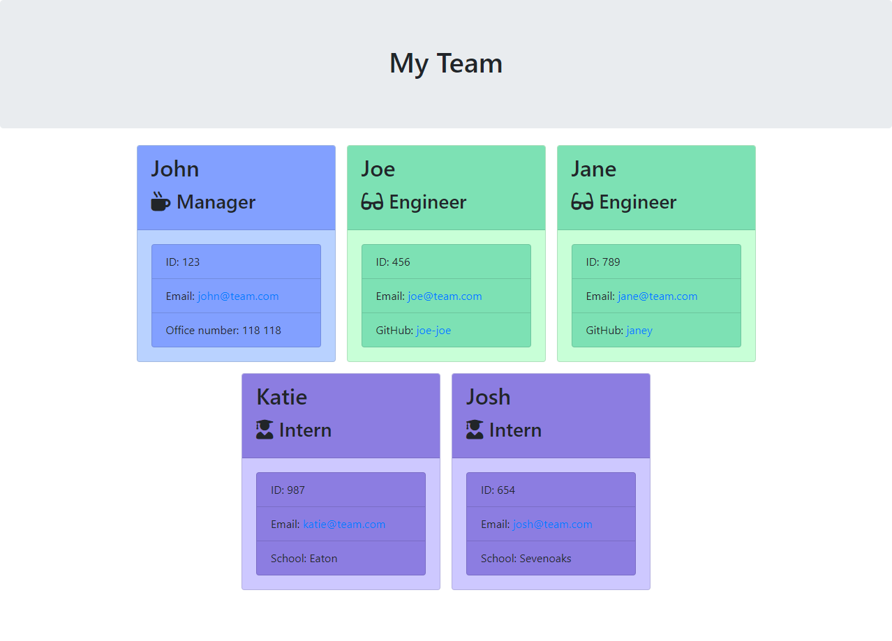

# Team Profile Generator (node.js)

[](https://opensource.org/licenses/MIT)

## Description

This is a Team Profile generator to quickly and easily create a simple and clear team profile for team.

Writing Team Profiles from scratch every time can be time consuming and may lead to inconsistencies. That's where this commandline app comes in to help streamline the process and simply add all of the information you need!



## Table of Contents

- [Installation](#installation)
- [Usage](#usage)
- [Credits](#credits)
- [License](#license)
- [Contributing](#contributing)
- [Tests](#tests)
- [Questions](#questions)

## Installation

Follow the following steps to install the app:

- Open your commandline (e.g. Git Bash) or terminal
- Navigate to the repository
- Type ```npm i``` to install all npm dependencies

## Usage

- Open your commandline (e.g. Git Bash) or terminal
- Navigate to the repository
- Type ```node index.js``` to start the app
- Follow the prompts to add all of the relevant information about team members.
- When prompted, choose whether you want to add more team members or ```Finish building the team```
- When you have finished and choose ```Finish building the team``` you will see the following message ```HTML File Created Successfully!```
- The HTML file will be added to a subdirectory called ```output```

## Credits

### Attributions:

- npm ([Link to Website](https://www.npmjs.com))

## License

This project uses the following license:

The MIT License

[](https://opensource.org/licenses/MIT)

## Contributing

Feel free to clone this repository to your local computer and explore the code. If you think some improvements can be made you can get in touch with me using the details in the [questions](#questions) section below.

## Tests

I am not aware of any bugs in the current version of the app, but if you encounter anything, please get in touch with me using the details in the [questions](#questions) section below.

## Questions

If you have any questions, feel free to contact me trhough my [GitHub profile](https://github.com/dalvat) or [email me](mailto:dmlswebdev@gmail.com).
